# AutoML App 🚀

Welcome to the AutoML App, a powerful tool for automated machine learning and data analysis. 

## Table of Contents
1. [Overview](#overview)
2. [Getting Started](#getting-started)
3. [Tasks](#tasks)
   - [Upload Data 📂](#1-upload-data-📂)
   - [Feature Engineering 🛠️](#2-feature-engineering-🛠️)
   - [Regression Model Maker 📈](#3-regression-model-maker-📈)
   - [Classification Model Maker 📊](#4-classification-model-maker-📊)
   - [Clustering Model Maker 🧩](#5-clustering-model-maker-🧩)

## Overview

This app allows you to perform various tasks for automated machine learning and data analysis. Choose a task from the options below and follow the instructions to get started.

## Getting Started

1. Clone this repository.
2. Install the required packages using `pip install -r requirements.txt`.
3. Run the app with Streamlit: `streamlit run homebase.py`.

## Tasks

### 1. Upload Data 📂

Start by uploading your dataset. Supported file formats include CSV and Excel files. Make sure your data is clean and well-structured for analysis.

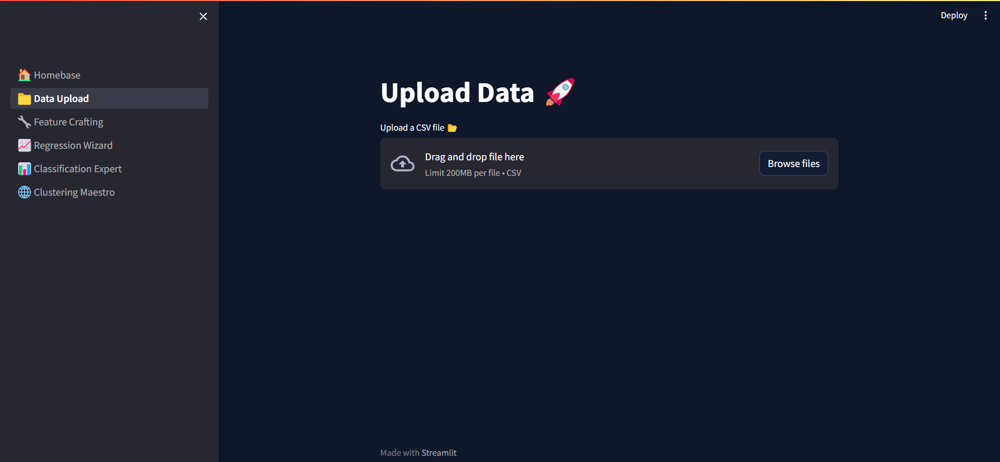
***
---
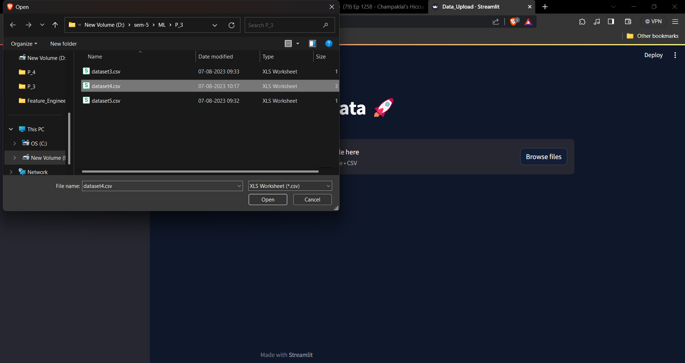
***
---
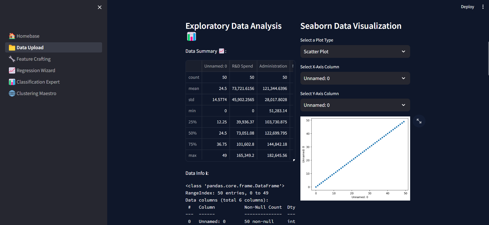
***
---
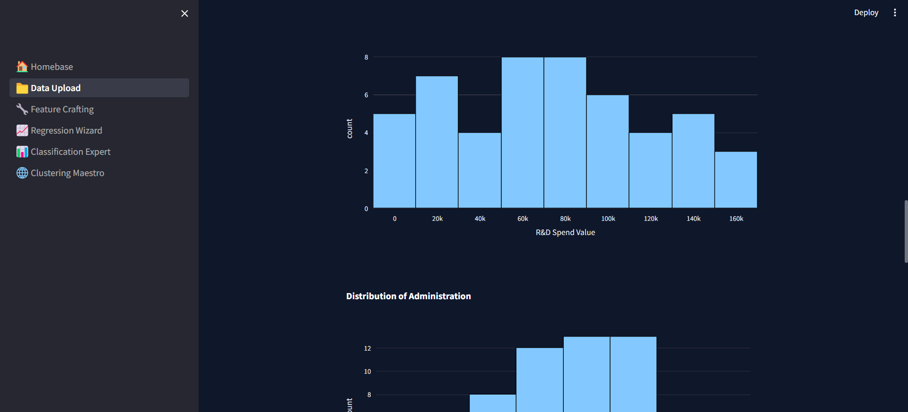
***

You can find the 'Upload Data' page in the sidebar. Follow the steps to upload your dataset.

### 3. Feature Engineering 🛠️

After uploading your dataset, you can explore and visualize the data. View summary statistics, data distribution, and correlations to understand your data better.

Feature engineering is essential for building accurate models. Handle missing values, encode categorical variables, and create new features.

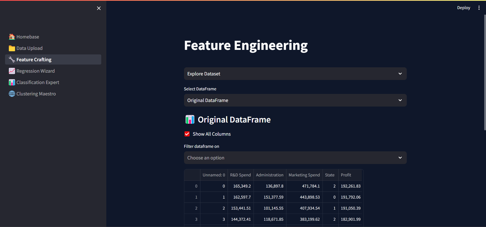
***
---
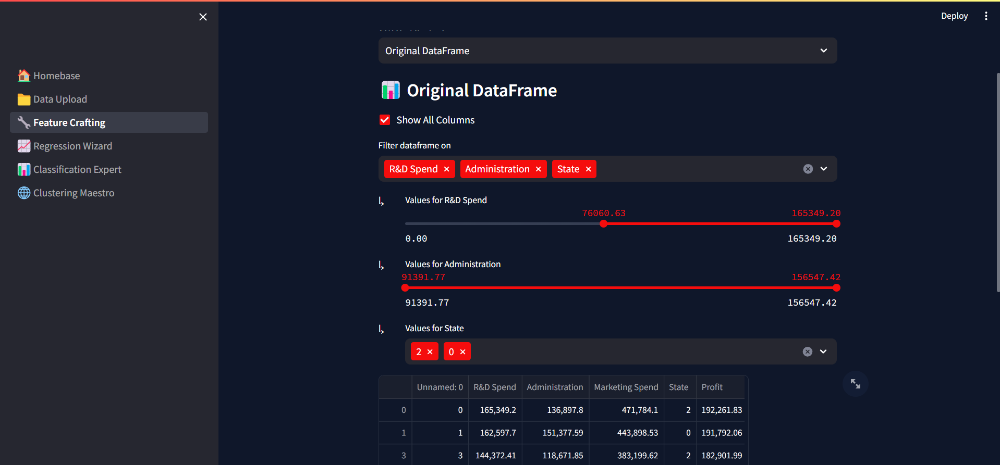
***
---
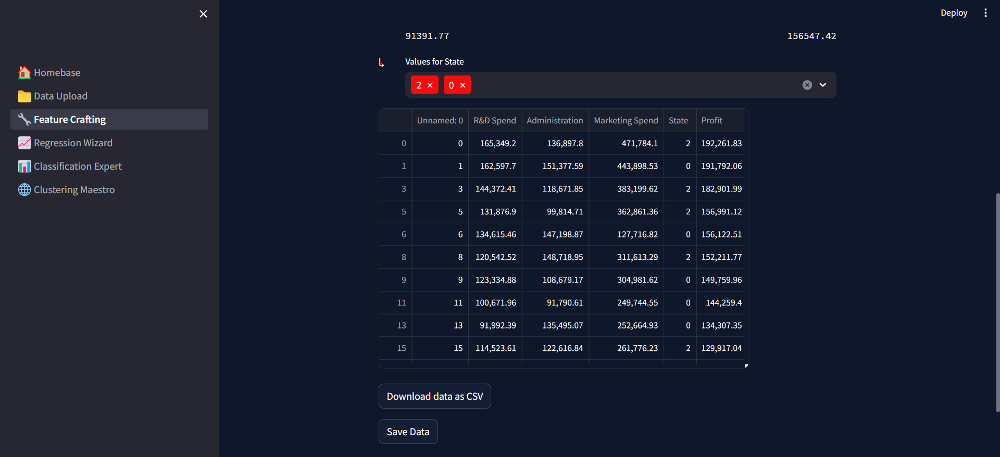
***
---
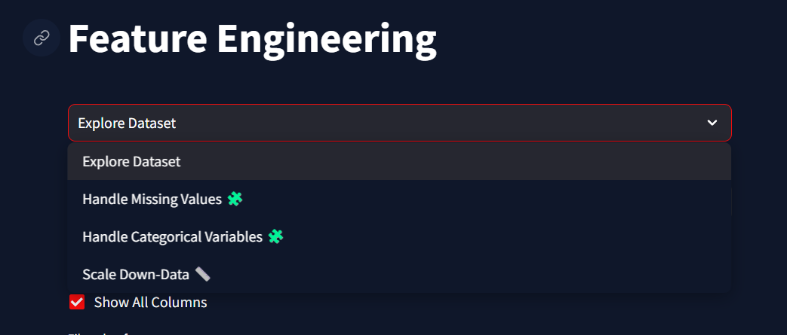
***
---
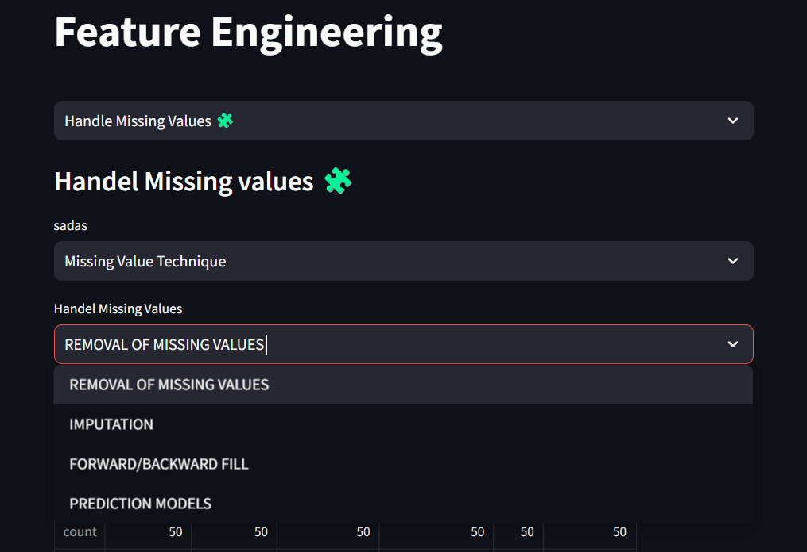
***

Visit the 'Feature Engineering' page to preprocess your data for modeling.

### 4. Regression Model Maker 📈

If you want to predict numeric values, use the Regression Model Maker. Select your target variable and choose from various regression algorithms.

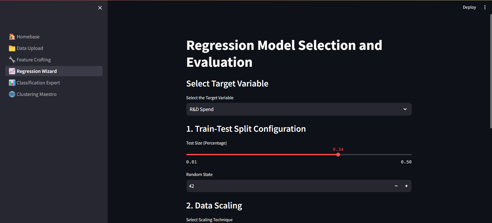
***
---
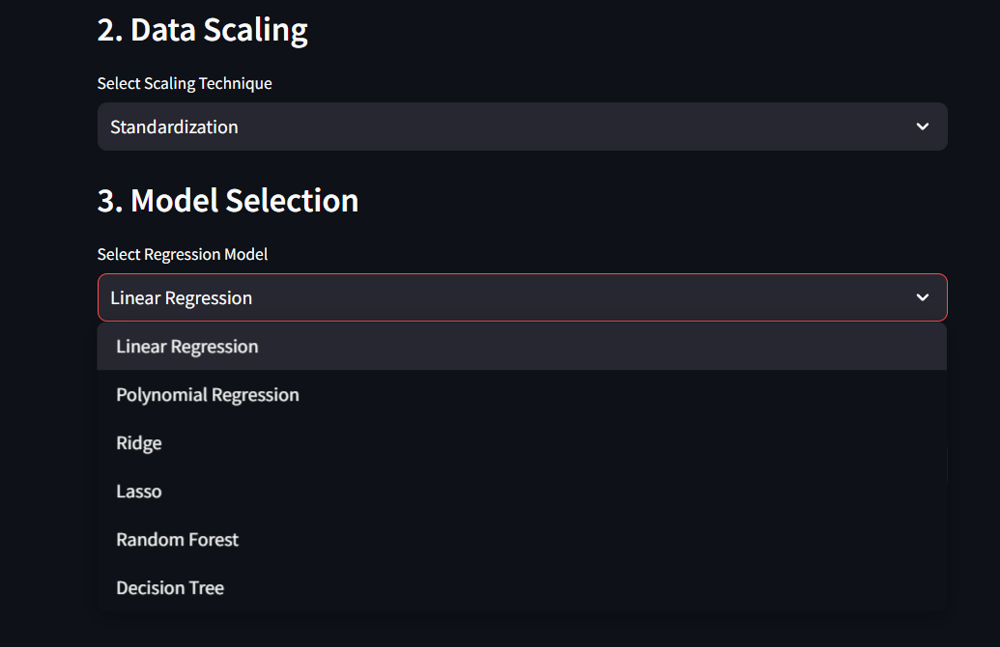
***
---
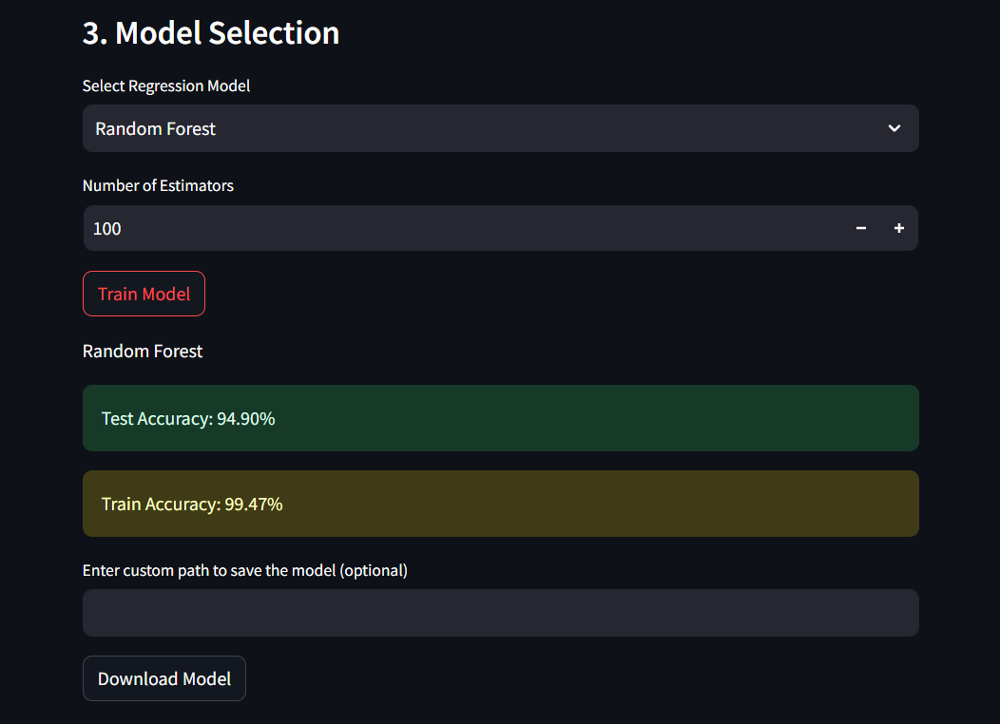
***

Go to the 'Regression Model Maker' page to train and evaluate regression models.

### 5. Classification Model Maker 📊

For classification tasks, the Classification Model Maker is your tool. Select the target class and pick an algorithm to create predictive models.

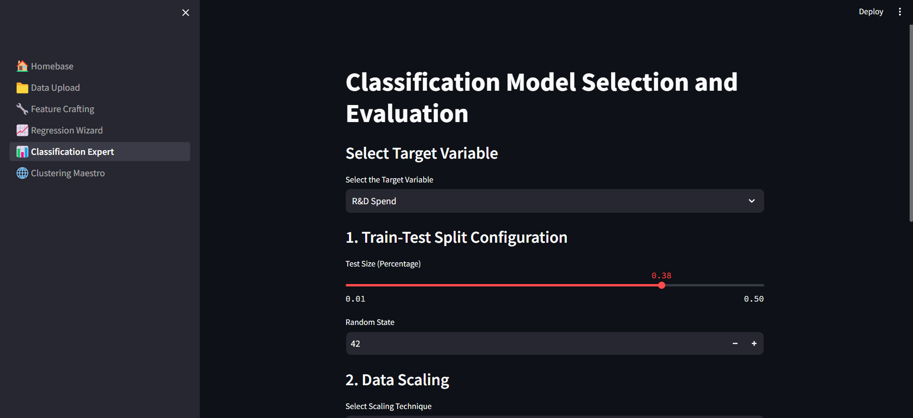
***

Head to the 'Classification Model Maker' page to work with classification models.

### 6. Clustering Model Maker 🧩

Clustering helps discover patterns in your data. Select a clustering algorithm and visualize your data clusters.

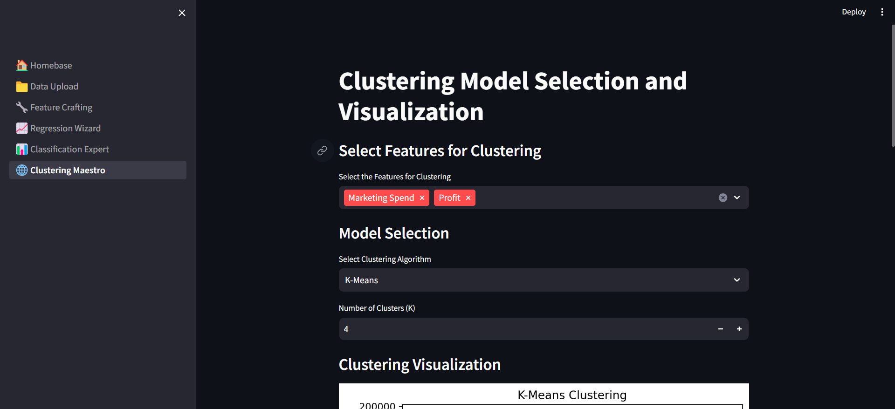
***
---
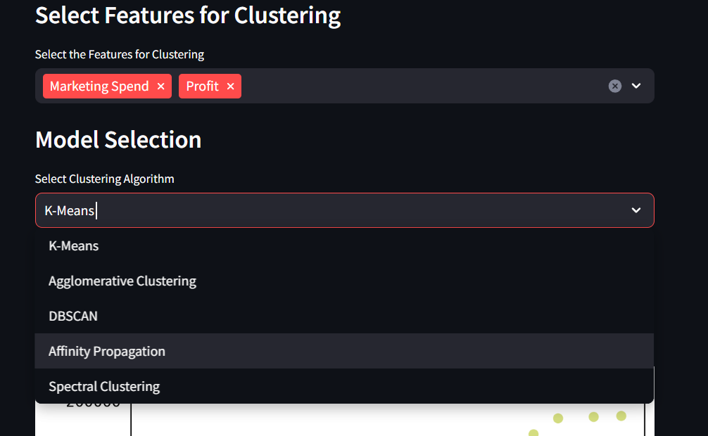
***
---
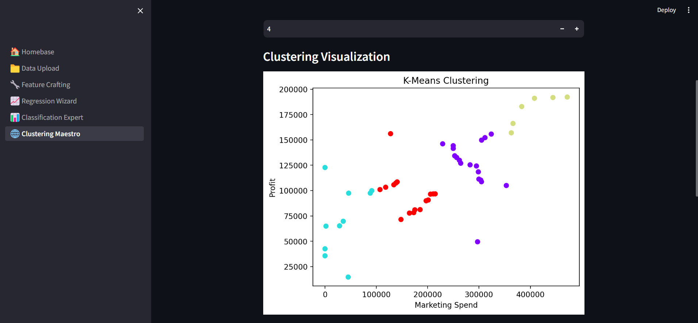

Use the 'Clustering Model Maker' page to perform clustering analysis on your dataset.
